.. sectnum::

.. footer:: Page ###Page###

Deep Space Trader 1.3.0
-----------------------

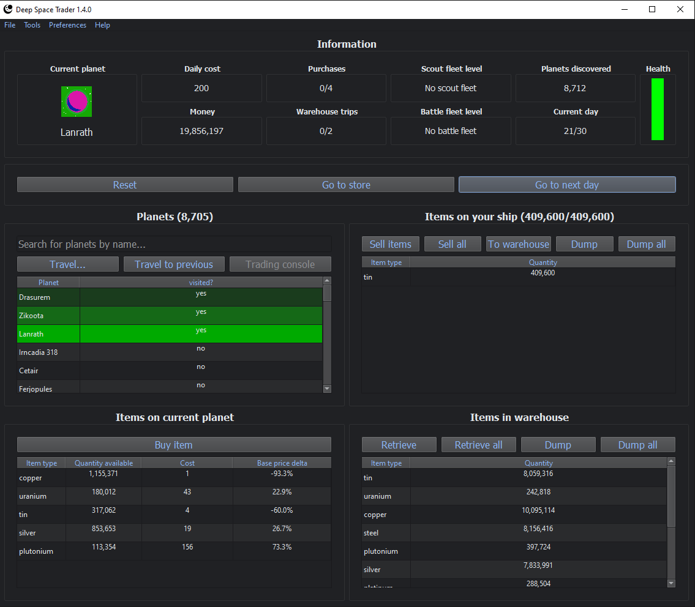

Deep Space Trader is a turn-based strategy game inspired by, and similar in gameplay to,
the old DOS game "Drugwars".

..
  .. contents:: Table Of Contents

Install
=======

Pre-built windows binary
########################

Download the `Windows x64 installer <https://github.com/eriknyquist/deep_space_trader/releases/latest>`_

Python package
##############

Install as a python package:

::

    pip install deep_space_trader

Introduction
============

The player starts off on a planet within a system of 8 randomly-generated planets.
Each planet has various raw materials available for trading (13 types of raw material in total),
all with prices that differ from planet to planet, and fluctuate over time. The goal of the game
is to make as much money as possible by buying and selling raw materials between planets.

The player has an item inventory for raw materials, with a fixed (but upgradeable) capacity.
Only items in the inventory can be bought or sold. The player also has a warehouse with unlimited
capacity. Items can be transferred between the item inventory and the warehouse, but only
a certain number of transfers between item inventory and warehouse can be made per day.

Travelling between planets always incurs a risk of encountering pirates, who may
kill the player or rob them of their money / raw materials. The greater the value that the
player is travelling with (combined value of player's money and items in the player's inventory,
but not the warehouse), the greater the chance of encountering pirates.

The player can use any earned money to buy "upgrades" from a store. Only a certain number of
store purchases can be made per day. Some of the upgrades
allow the player to:

* Destroy planets altogether and acquire all their raw materials
  (Destroying a planet incurs a risk that the planet may fight to resist, which may kill the player)

* Buy and upgrade a battle fleet, which increases chances of winning fights against pirates,
  and against planets that resist destruction

* Buy and upgrade a scout fleet, which allows the player to discover thousands of
  new planets

* Upgrade the player's inventory capacity, which increases the number of items that can
  be bought or sold at once.

* Increment the number of warehouse trips allowed per day

Complete Game Reference
=======================

This following section describes the functionality of all sections of all game windows
in detail. Each game window has its own section in this document, with further document subsections
for sections within the game window.

**Main window**
###############

This section describes the functionality of all sections on the main game window
(the largest window, which opens on game startup). Each section in the main game window
has its own section in this document.

**"Information" section**
+++++++++++++++++++++++++

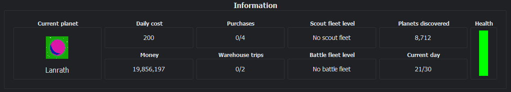

This section describes the functionality of the "Information" section of the main game window.
The "Information" section stretches across the entire top of the main game window, and
shows useful information about the current state of the game.

* **"Current Planet"**: Shows the name of, and an image of, the current planet the player is on.
* **"Current Day"**: Shows the current day number, against the total number of days before the game ends.
* **"Money"**: Shows the amount of money currently held by the player.
* **"Purchases"**: Shows the number of store purchases made by the player so far on the current day, against
  the total number of store purchases allowed on the current day (see `"Store" window`_ for more information).
* **"Planets discovered"**: Shows the total number of planets that have been discovered by the player.
  This number includes planets that have not been visited by the player, and planets that have been
  destroyed by the player.
* **"Scout fleet level"**: Shows the current upgrade level of the players scout fleet, against the
  maximum possible upgrade level for the players scout fleet. (see `"Store" window`_ for more information
  about upgrading the scout fleet).
* **"Battle fleet"**: Shows the current upgrade level of the players battle fleet, against the
  maximum possible upgrade level for the players battle fleet. Also shows the chance (percentage) of
  the player winning a battle, based on current battle fleet upgrade level. (see `"Store" window`_ for more
  information about upgrading the battle fleet).

**Global buttons section**
++++++++++++++++++++++++++

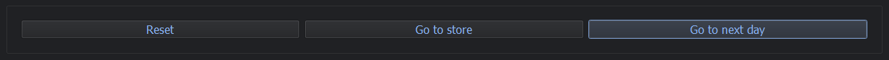

This section describes the functionality of the 3 large buttons at the top of the
main game window, directly underneath the "Information" section.

* **"Reset" button**: Aborts the current game and starts a new game (Warning: player will lose
  all progress in the current game. When clicked, this button will first show a prompt,
  asking the player to confirm that they want to reset the game).

* **"Go to store" button**: Opens the Store window. See `"Store" window`_ for more details.

* **"Go to next day" button**: Advances the current day by 1. Often, the next day is reached by
  travelling to another planet, but this button advances to the next day without travelling.

**"Planets" section**
+++++++++++++++++++++

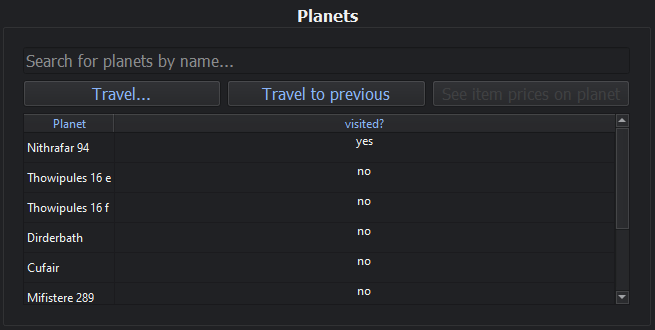

This section describes the functionality of the "Planets" section of the main game
window. The "Planets" section is used for travelling between planets, and allows the player
to select the planet they want to travel to. The "Planets" section is displayed in the middle
left area of the main game window.

* **"Travel..." button**: Causes the player to travel to the selected planet. The player can also
  travel to a planet by double-clicking on the planet name in the "Planets" section. Travelling
  to a planet costs 100 of the player's money, and advances the current day by 1. Travelling always
  incurs a risk of encountering a pirate fleet. When encountered, the player will be given the choice
  to fight or not. If the player chooses to fight, and wins, then the player can continue their journey
  unscathed. If the player chooses to fight, and loses, then the player will die, and the game will end.
  The chance of the player winning a fight against pirates is directly correlated to the upgrade level
  of the players battle fleet (See `"Store" window`_). If the player chooses not to fight, then they
  will not die, but the pirates will steal (almost) all of the players money, and all of the items
  stored on the players ship. Items stored in the warehouse cannot be touched by pirates.

* **"Travel to previous" button**: Causes the player to travel to the planet that they were on
  directly before the current planet. Travelling to a planet costs 100 of the player's money,
  and advances the current day by 1.

* **Planet display table**: shows a list of all planets available to the player. Consists of two
  columns: The rightmost column, labelled "visited?", shows "yes" or "no" indicating whether
  the player has travelled to the planet. The leftmost column, labelled "Planet", shows the
  name of the planet. The player can travel to a planet by double-clicking on the planet name
  within the planet display table.

**"Items on current planet" section**
+++++++++++++++++++++++++++++++++++++

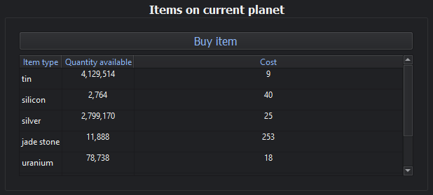

This section describes the functionality of the "Items on current planet" section of the main
game window. The "Items on current planet" section is used for browsing & buying items from
the planet that the player is currently on. The "Items on current planet" section is displayed
in the bottom left area of the main game window.

* **"Buy item" button**: Allows the player to purchase 1 or more of the selected items in the
  item display table. When clicked, this button will open a new window that allows the player to
  select the quantity they wish to purchase of the selected item (See `"Buy item" window`_ reference
  section in this document for more details about this window).

* **Item display table**: Displays all items available for purchase on the current planet.
  Consists of three columns: The rightmost column, labelled "Cost", displays the cost of 1
  item. The middle column, labelled "Quantity available", shows the number of items available
  for purchase on the current planet. The leftmost column, labelled "Item type", shows the
  item name. The player can attempt to buy an item by double-clicking on the item name
  within the item display table. Pressing enter with an item selected will display a new
  window showing the item price over time (from day 1 until the current day).

**"Items on your ship" section**
++++++++++++++++++++++++++++++++

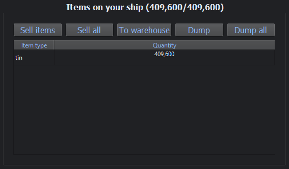

This section describes the functionality of the "Items on your ship" section of the main
game window. The "Items on your ship" section is used for browsing / managing items that
reside on the players ship, that have either been purchased from a planet or that have been
retrieved from the warehouse. The "Items on your ship" section is displayed in the middle
right area of the main game window.

* **"Sell items" button**: Allows the player to attempt to sell 1 or more of the selected
  item to the current planet. When clicked, this button will open a new window that allows
  the player to select the quantity they wish to sell of the selected item (See `"Sell items" window`_).
  If the current planet does not already hold any of the selected item, then the player
  will be asked if they want to provide a free (small quantity) sample of the item.
  If the player does not provide a free sample, then the item cannot be sold to the current
  planet. If the player does provide a free sample, then the planet may or may not decide to
  begin trading in the selected item. Only one free sample of a given item may be given to
  the same planet in the same day.

* **"Sell all" button**: Allows the player to attempt to sell all items on the ship to
  the current planet. Only items that the current planet already holds will be sold
  (free samples can only be provided via the "Sell items" button).

* **"Add to warehouse" button**: Allows the player to move 1 or more of the selected item
  from their ship to the warehouse. Unlike the player's ship, the warehouse has infinite
  capacity, but only one move to/from the warehouse per day is allowed (i.e. one trip
  to the warehouse per day). Additional warehouse trips per day can be purchased from the Store
  (See `"Store" window`_ for more details about the store window).
  Clicking this button opens a new window that allows the player to select the quantity of
  the item they want to move to the warehouse (see `"Move to warehouse" window`_).

* **"Dump selected" button**: Throws away the selected items to free up capacity on the
  player's ship. Opens a new window that allows the player to select the quantity they wish to
  dump of the selected item (See `"Dump player items" window`_).

* **"Dump all" button**: Throws away all items on the players ship.

* **Item display table**: Displays all items stored on the player's ship. Consists of
  two columns: The rightmost column, labelled "Quantity", shows the number of items stored
  on the player's ship. The leftmost column, labelled "Item type", shows the item name. The
  player can attempt to sell an item by double-clicking on the item name within the item
  display table.

**"Items in warehouse" section**
++++++++++++++++++++++++++++++++

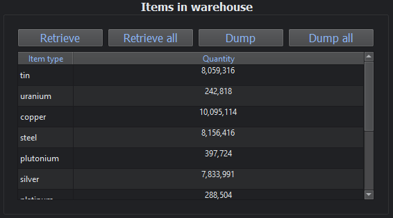

This section describes the functionality of the "Items in warehouse" section of the main
game window. The "Items in warehouse" section is used for browsing / managing items that
reside in the warehouse. The "Items in warehouse" section is displayed in the bottom
right area of the main game window.

* **"Retrieve items" button**: Allows the player to move 1 or more of the selected items
  from the warehouse to their ship. Only one move to/from the warehouse per day is allowed
  (i.e. one trip to the warehouse per day). Clicking this button opens a new window that
  allows the player to select the quantity of the item they want to move to their ship (see
  `"Retrieve from warehouse" window`_).

* **"Retrieve all" button**: Moves all warehouse items (or however many will fit) to the
  player's ship.

* **"Dump selected" button**: Throws away the selected items from the warehouse. Opens a new
  window that allows the player to select the quantity they wish to dump of the selected items
  (see `"Dump warehouse items" window`_).

* **"Dump all" button**: Throws away all items in the warehouse.

* **Item display table**: Displays all items stored in the warehouse. Consists of
  two columns: The rightmost column, labelled "Quantity", shows the number of items stored
  in the warehouse. The leftmost column, labelled "Item type", shows the item name. The
  player can move an item to their ship by double-clicking on the item name within the item
  display table.

**"Store" window**
##################

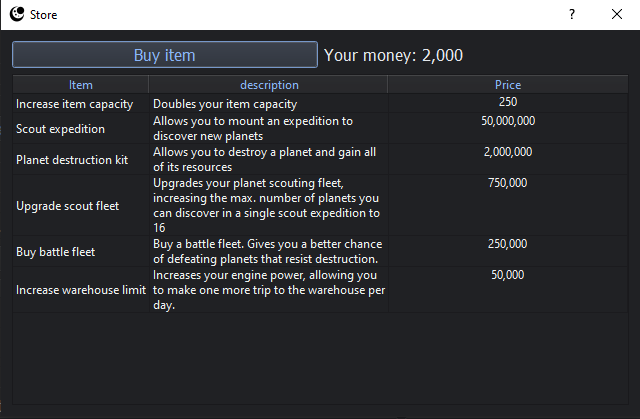

This section describes the functionality of the "Store" window. The store window can be reached
by clicking the "Go to store" button in the `Global buttons section`_ of the main window. The
store window allows the player to exchange money for various upgrades and services. Only 4 store
purchases can be made per day, but this number is increased when the player reaches certain scores
(see `Score bonuses`_ for more information).

* **Increase item capacity**: Buying this item doubles the number of items that can be
  stored on the players ship. This item can be bought an unlimited number of times.

* **Scout expedition**: Buying this item allows the player to discover between 4-8 new planets,
  which will become available in the `"Planets" section`_. More planets can be discovered per
  scout expedition by purchasing the "Upgrade scout fleet" store item.

* **Planet destruction kit**: Buying this item allows the player to destroy one planet and obtain
  all of its materials. The planet will disappear from the `"Planets" section`_ and all materials
  held by the planet will be transferred to the player's warehouse. Opens a new window that allows
  the player to pick which planet they want to destroy, or optionally destroy all planets at once
  (except for the current planet) for a higher price. There is a small chance that a single planet may
  resist destruction and attempt to fight back. The higher number of planets being destroyed, the
  higher the chance of one planet resisting will be. The player must decide whether to fight, or leave
  the planet alone. If the player fights and loses, the player will die and the game will be over.
  If the player fights and wins, then planet destruction will continue normally. The chance of
  the player winning this fight depends on the player's battle fleet level.

* **Upgrade scout fleet**: Buying this item increases the number of planets than can be
  discovered on a single scout expedition. This item can be bought a maximum of 9 times,
  to upgrade the scout fleet through levels 1 to 10.

  * *Scout fleet level 1*: between 4 and 8 new planets per scout expedition
  * *Scout fleet level 2*: between 4 and 16 new planets per scout expedition
  * *Scout fleet level 3*: between 4 and 32 new planets per scout expedition
  * *Scout fleet level 4*: between 4 and 64 new planets per scout expedition
  * *Scout fleet level 5*: between 4 and 128 new planets per scout expedition
  * *Scout fleet level 6*: between 4 and 256 new planets per scout expedition
  * *Scout fleet level 7*: between 4 and 512 new planets per scout expedition
  * *Scout fleet level 8*: between 4 and 1024 new planets per scout expedition
  * *Scout fleet level 9*: between 4 and 2048 new planets per scout expedition
  * *Scout fleet level 10*: between 4 and 4096 new planets per scout expedition

* **Buy/upgrade battle fleet**: Buying this item for the first time gives the player a
  battle fleet, which increases the chances of the player winning battles against planets
  that resist destruction, or when being robbed while travelling between planets. Subsequent
  purchases of this item upgrade the battle fleet through levels 1-10.

  * *Battle fleet level 0 (no battle fleet)*: 1% chance of winning battles
  * *Battle fleet level 1*: 10% chance of winning battles
  * *Battle fleet level 2*: 15% chance of winning battles
  * *Battle fleet level 3*: 20% chance of winning battles
  * *Battle fleet level 4*: 25% chance of winning battles
  * *Battle fleet level 5*: 35% chance of winning battles
  * *Battle fleet level 6*: 50% chance of winning battles
  * *Battle fleet level 7*: 65% chance of winning battles
  * *Battle fleet level 8*: 80% chance of winning battles
  * *Battle fleet level 9*: 95% chance of winning battles
  * *Battle fleet level 10*: 99% chance of winning battles

* **Increase warehouse limit**: Buying this item will increase by 1 the number of warehouse trips
  that the player can make in a single day.

**"Buy item" window**
#####################

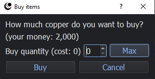

This section describes the functionality of the "Buy" window. The "Buy" window is displayed
when the player clicks the "Buy item" button in the `"Items on current planet" section`_.

* **"Buy" button**: Purchases the selected quantity of the item. This button will do nothing
  when the selected quantity is 0.

* **"Cancel" button**: Cancels the transaction.

* **"Max" button**: Automatically sets the quantity to the maximum number of items available,
  or the maximum number of items that the player can afford (whichever is smaller).

**"Sell items" window**
#######################

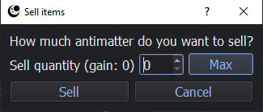

This section describes the functionality of the "Sell" window. The "Sell" window is displayed
when the player clicks the "Sell items" button in the `"Items on your ship" section`_.

* **"Sell" button**: Sells the selected quantity of the item. This button will do nothing
  when the selected quantity is 0.

* **"Cancel" button**: Cancels the transaction.

* **"Max" button**: Automatically sets the quantity to the maximum number of items available
  to sell.

**"Dump player items" window**
##############################

.. image:: images/dump_ship_window.png

This section describes the functionality of the "Dump player items" window. The "Dump player items"
window is displayed when the player clicks the "Dump selected" button in the `"Items on your ship" section`_.

* **"Dump" button**: Dumps the selected quantity of the item. This button will do nothing
  when the selected quantity is 0.

* **"Cancel" button**: Cancels the item dump.

* **"Max" button**: Automatically sets the quantity to the maximum number of items available
  on the players ship.

**"Move to warehouse" window**
##############################

.. image:: images/to_warehouse_window.png

This section describes the functionality of the "Move to warehouse" window. The "Move to warehouse"
window is displayed when the player clicks the "Add to warehouse" button in the `"Items on your ship" section`_.

* **"Move" button**: Moves the selected quantity of the item to the warehouse. This button will do nothing
  when the selected quantity is 0.

* **"Cancel" button**: Cancels the item move.

* **"Max" button**: Automatically sets the quantity to the maximum number of items available
  on the players ship.

**"Dump warehouse items" window**
#################################

.. image:: images/dump_warehouse_window.png

This section describes the functionality of the "Dump warehouse items" window. The "Dump warehouse items"
window is displayed when the player clicks the "Dump selected" button in the `"Items in warehouse" section`_.

* **"Dump" button**: Dumps the selected quantity of the item. This button will do nothing
  when the selected quantity is 0.

* **"Cancel" button**: Cancels the item dump.

* **"Max" button**: Automatically sets the quantity to the maximum number of items available
  in the warehouse.

**"Retrieve from warehouse" window**
####################################

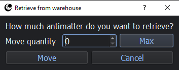

This section describes the functionality of the "Retrieve from warehouse" window. The "Retrieve from warehouse"
window is displayed when the player clicks the "Retrieve items" button in the `"Items in warehouse" section`_.

* **"Move" button**: Moves the selected quantity of the item to the player's ship. This button will do nothing
  when the selected quantity is 0.

* **"Cancel" button**: Cancels the item move.

* **"Max" button**: Automatically sets the quantity to the maximum number of items available
  in the warehouse, or the maximum number of items that can fit on the player's ship (whichever is smaller).

**Item price history window**
#############################

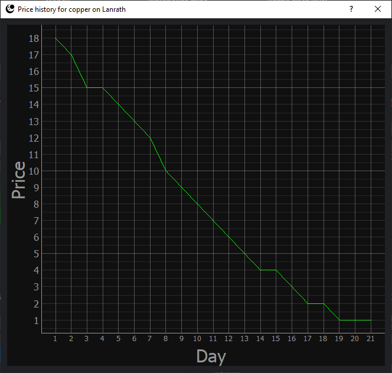

The price graph window shows the changing price of an item on a particular planet over time
(from day 1 until the current day). The price graph window is displayed when the player selects
an item in the `"Planets" section`_ and presses enter.

**"High score sharing" window**
###############################

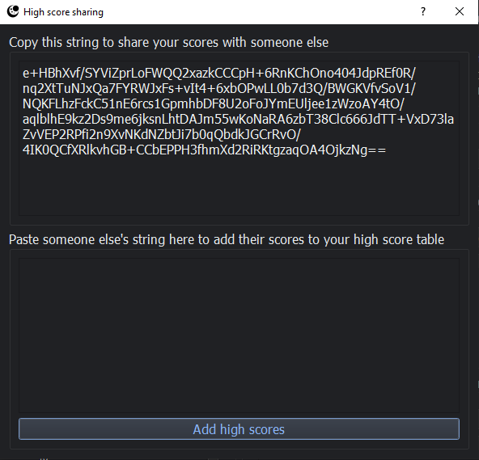

This section describes the functionality of the "High score sharing" window. The "High score sharing"
window is displayed when the "High score sharing" option is selected from the "File" menu in the
main game window (e.g. **File->High score sharing**). The "High score sharing" window can also be
opened via the keyboard shortcut Ctrl-R.

The "High score sharing" window allows players to share high scores, by copying/sharing an "encrypted"
string containing the players high scores. When a player copies another player's string into their
"High score sharing" window, then the scores contained within the string will be added to the player's
own high scores.

* **To share your high scores with someone else**: Copy the string displayed in the top section of
  the "High score sharing" window, and give it to the other player that you wish to share scores with.

* **To add someone elses high scores to your game**: Paste the string provided by another player into
  the bottom section of the "High score sharing" window, and click the "Add high scores" button at the
  bottom of the "High score sharing" window. The other players scores will be added to your high score table.

**"Prices" window**
###################

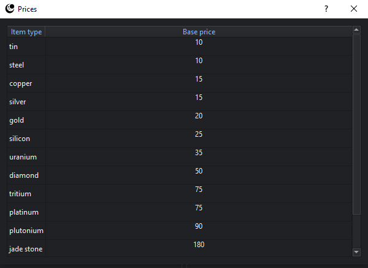

The section describes the functionality of the "Prices" window. The "Prices" window is displayed
when the "Material prices" option is selected from the "Tools" menu in the main game window
(e.g. **Tools->Material Prices**). The "Prices" window can also be opened via the keyboard shortcut Ctrl-A.

The "Prices" window shows the usual price for all materials, and can be used as a trading reference.
The "Prices" window does *not* show the exact item prices for any particular planet. Planets will set their
own item prices, and the prices in the "Prices" window are merely suggestions for them.

**"Travel log" window**
#######################

.. image:: images/travel_log_window.png

This section describes the functionality of the "Travel log" window. The "Travel log" window
is displayed when the "Show travel log" option is selected from the "Tools" menu (e.g.
**Tools->Show travel log**). The "Travel log" window can also be opened via the keyboard shortcut
Ctrl-S.

The "Travel log" shows all planets that the player has travelled to, in chronological order, along
with the day on which they were travelled to.

**"Transaction log" window**
############################

.. image:: images/transaction_log_window.png

This section describes the functionality of the "Transaction log" window. The "Transaction log" window
is displayed when the "Show transaction log" option is selected from the "Tools" menu (e.g.
**Tools->Show transaction log**). The "Transaction log" window can also be opened via the keyboard shortcut
Ctrl-T.

The "Transaction log" shows all material sales/purchases made by the player, in chronological order, along
with the day on which the transaction occurred and the planet involved in the transaction.

**Miscellaneous details**
#########################

This section describes miscellaneous functionality that is not necessarily related
to any particular game window.

Score bonuses
+++++++++++++

When the player reaches 1,000,000,000 money, the total number of days is increased from 30 to 35,
and the number of store purchases allowed per day is increased from 4 to 5.

When the player reaches 100,000,000,000 money, the total number of days is increased from 35 to 40,
and the number of store purchases allowed per day is increased from 5 to 6.
