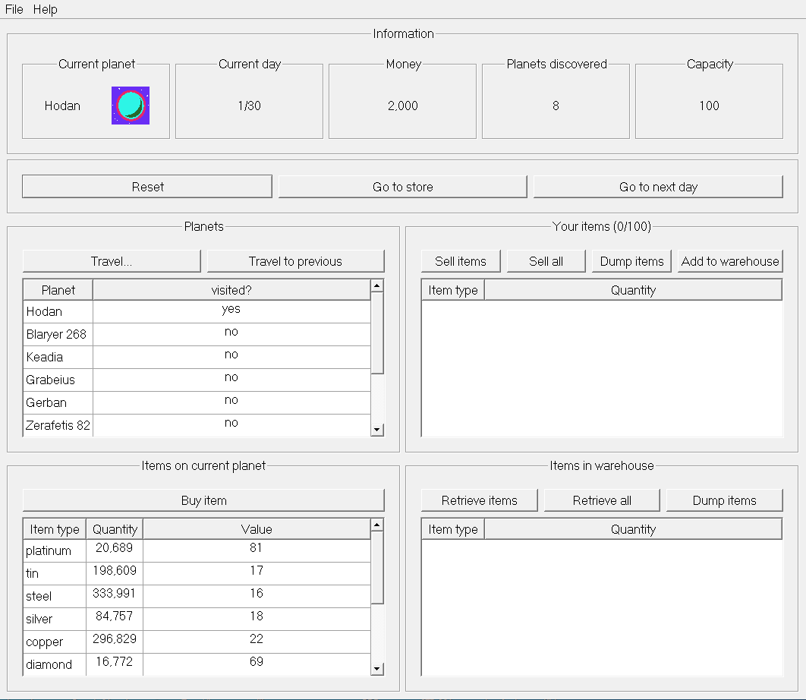

Deep Space Trader
-----------------

Deep Space Trader is a simple turn-based strategy game where the goal is to make
as much money as possible by travelling between different planets to buy and sell
raw materials. It is inspired by, and similar in gameplay to, the old DOS game
"Drugwars".

In Deep Space Trader, unlike Drugwars, you can mount expeditions to discover a
large number of new planets to trade with, and you also have the option to completely
destroy any planet and obtain all of the raw materials it holds (for a price,
of course).

Install
-------

Download the latest `windows build <windows_build/deep-space-trader-1.0.1.exe>`_
