.. sectnum::

Deep Space Trader 1.4.0
-----------------------

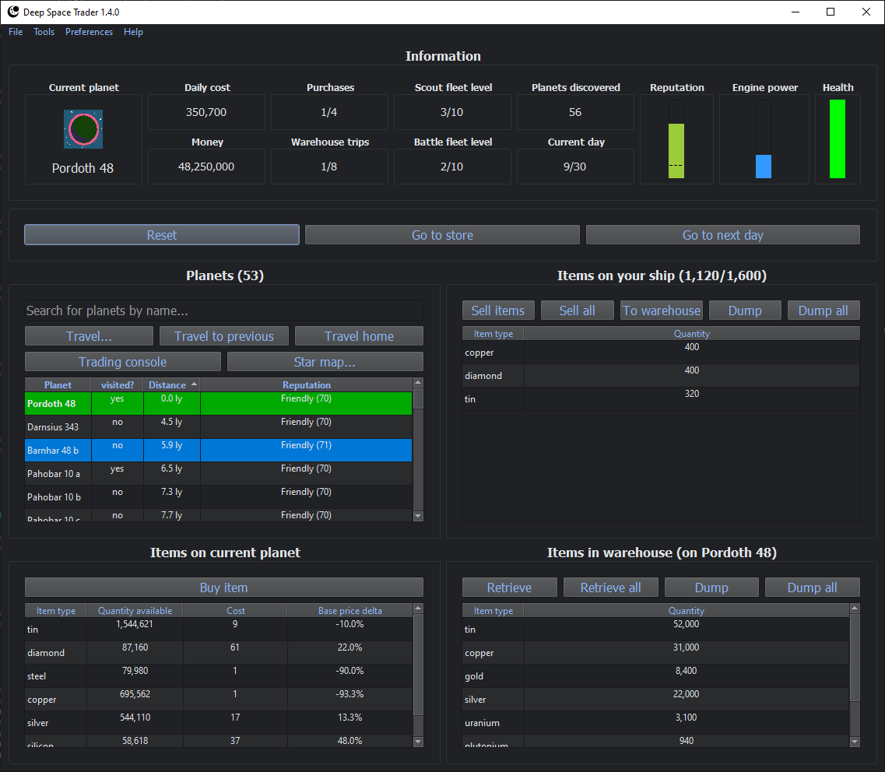

Deep Space Trader is a turn-based strategy game inspired by, and similar in gameplay to,
the old DOS game "Drugwars".

..
  .. contents:: Table Of Contents

Install
=======

Pre-built windows binary
########################

Download the `Windows x64 installer <https://github.com/eriknyquist/deep_space_trader/releases/latest>`_

Python package
##############

Install as a python package:

::

    pip install deep_space_trader

And run like so:

::

    python -m deep_space_trader

Introduction
============

The player starts off on a planet within a system of 8 randomly-generated planets.
Each planet has various raw materials available for trading (13 types of raw material in total),
all with prices that differ from planet to planet, and fluctuate over time. The goal of the game
is to make as much money as possible by buying and selling raw materials between planets.

The player has an item inventory for raw materials, with a fixed (but upgradeable) capacity.
Only items in the inventory can be bought or sold. The player also has a warehouse with unlimited
capacity. Items can be transferred between the item inventory and the warehouse, but only
a certain number of transfers between item inventory and warehouse can be made per day.

Travelling between planets always incurs a risk of encountering pirates, who may
kill the player or rob them of their money / raw materials. The greater the value that the
player is travelling with (combined value of player's money and items in the player's inventory,
but not the warehouse), the greater the chance of encountering pirates.

The player can use any earned money to buy "upgrades" from a store. Only a certain number of
store purchases can be made per day. Some of the upgrades
allow the player to:

* Destroy planets altogether and acquire all their raw materials
  (Destroying a planet incurs a risk that the planet may fight to resist, which may kill the player)

* Buy and upgrade a battle fleet, which increases chances of winning fights against pirates,
  and against planets that resist destruction

* Buy and upgrade a scout fleet, which allows the player to discover thousands of
  new planets

* Upgrade the player's inventory capacity, which increases the number of items that can
  be bought or sold at once.

* Increase the number of warehouse trips allowed per day

Complete Game Reference
=======================

This following section describes the functionality of all sections of all game windows
in detail. Each game window has its own section in this document, with further document subsections
for sections within the game window.

**Main window**
###############

This section describes the functionality of all sections on the main game window
(the largest window, which opens on game startup). Each section in the main game window
has its own section in this document.

**"Information" section**
+++++++++++++++++++++++++

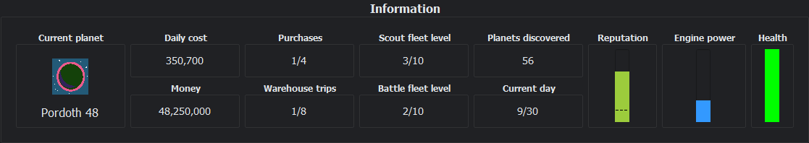

This section describes the functionality of the "Information" section of the main game window.
The "Information" section stretches across the entire top of the main game window, and
shows useful information about the current state of the game.

* **"Current Planet"**: Shows the name of, and an image of, the current planet the player is on.
* **"Daily cost"**: Current daily cost of living that gets subtracted from your money on each new day.
* **"Money"**: Shows the amount of money currently held by the player.
* **"Purchases"**: Shows the number of store purchases made by the player so far on the current day, against
  the total number of store purchases allowed on the current day (see `"Store" window`_ for more information).
* **"Warehouse trips"**: Shows the number of trips to the warehouse made by the player so far on the current day,
  against the total number of warehouse trips allowed on the current day (see `"Store" window`_ for
  more information).
* **"Engine power"**: A blue bar, next to the health bar, that fills up as the player increases their
  engine power, up to the maximum of 10 (see `"Store" window`_). When tooltips are enabled, hovering over
  this section shows the engine power and the current travel cost per light-year.
* **"Scout fleet level"**: Shows the current upgrade level of the players scout fleet, against the
  maximum possible upgrade level for the players scout fleet. (see `"Store" window`_ for more information
  about upgrading the scout fleet).
* **"Battle fleet level"**: Shows the current upgrade level of the players battle fleet, against the
  maximum possible upgrade level for the players battle fleet. When tooltips are enabled, hovering over
  this section shows the chance (percentage) of the player winning a battle, based on current battle fleet
  upgrade level. (see `"Store" window`_ for more information about upgrading the battle fleet).
* **"Planets discovered"**: Shows the total number of planets that have been discovered by the player.
  This number includes planets that have not been visited by the player, and planets that have been
  destroyed by the player.
* **"Current Day"**: Shows the current day number, against the total number of days before the game ends.
* **"Health"**: Shows the players current health level.

**Global buttons section**
++++++++++++++++++++++++++

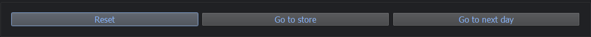

This section describes the functionality of the 3 large buttons at the top of the
main game window, directly underneath the "Information" section.

* **"Reset" button**: Aborts the current game and starts a new game (Warning: player will lose
  all progress in the current game. When clicked, this button will first show a prompt,
  asking the player to confirm that they want to reset the game).

* **"Go to store" button**: Opens the Store window. See `"Store" window`_ for more details.

* **"Go to next day" button**: Advances the current day by 1. Often, the next day is reached by
  travelling to another planet, but this button advances to the next day without travelling.

**"Planets" section**
+++++++++++++++++++++

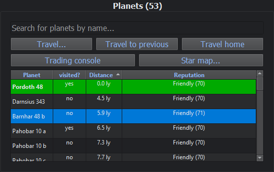

This section describes the functionality of the "Planets" section of the main game
window. The "Planets" section is used for travelling between planets, and allows the player
to select the planet they want to travel to. The "Planets" section is displayed in the middle
left area of the main game window.

* **"Travel..." button**: Causes the player to travel to the selected planet. The player can also
  travel to a planet by double-clicking on the planet name in the "Planets" section, or on the
  planet in the `"Star map" window`_. Every planet has a position in the galaxy, and the cost of
  travelling depends on the distance to the planet, in light-years (ly): 5 per light-year, with a
  minimum of 10. Engine upgrades make travel cheaper (see `"Store" window`_). The travel prompt shows
  the distance and the cost. Travelling always advances the current day by 1, however far the player
  goes. Travelling incurs a risk of encountering a pirate fleet. The risk grows with the player's
  wealth, and with the length of the trip: longer trips are riskier, and short hops are safer. When encountered, the player will be given the choice
  to fight or not. If the player chooses to fight, and wins, then the player can continue their journey
  without losing any money or items, but will lose some health (and will not recover health on the next
  day). If winning the fight brings the player's health down to 0, then the player will die. If the player
  chooses to fight, and loses, then the player will die.
  The chance of the player winning a fight against pirates, and the amount of health lost when winning,
  depend on the upgrade level of the players battle fleet (See `"Store" window`_). If the player chooses
  not to fight, then they will not die, but the pirates will steal all of the items stored on the players
  ship. If the players ship had no items on it, the pirates will also steal (almost) all of the players
  money; otherwise, there is a 20% chance that they will also steal (almost) all of the players money.
  Items stored in the warehouse cannot be touched by pirates.

* **"Travel to previous" button**: Causes the player to travel to the planet that they were on
  directly before the current planet. The cost depends on the distance, as for the "Travel..." button,
  and travelling advances the current day by 1.

* **"Travel home" button**: Causes the player to travel back to their home planet (the planet the
  game starts on), where their warehouse is. The cost depends on the distance, as for the "Travel..."
  button. The home planet can't be destroyed.

* **"Trading console" button**: Opens the trading console, which allows current item prices
  on the selected planet to be seen without travelling to the planet. Pressing the Enter key while a
  planet is selected will also open the trading console. The trading console can only be used if the
  "Trading console" item has been purchased from the `"Store" window`_.

  .. image:: images/trading_console.png

* **"Star map..." button**: Opens the `"Star map" window`_, which shows where all the planets are.

* **Planet display table**: shows a list of all planets available to the player. Consists of three
  columns: "Planet" shows the name of the planet, "visited?" shows "yes" or "no" indicating whether
  the player has travelled to the planet, and "Distance" shows how far the planet is from the current
  planet, in light-years. Clicking a column's header sorts the table by that column (e.g. click
  "Distance" to see the nearest planets first). The home planet is shown in bold. The player can travel
  to a planet by double-clicking on the planet name within the planet display table. The last 3 planets visited will be colored different shades of
  green- the current planet will be a bright green, the previous planet a darker green, and the
  planet before that the darkest green.

**"Items on current planet" section**
+++++++++++++++++++++++++++++++++++++

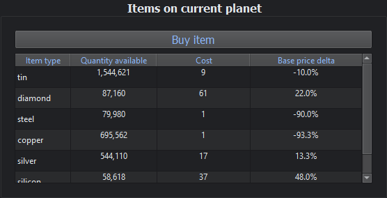

This section describes the functionality of the "Items on current planet" section of the main
game window. The "Items on current planet" section is used for browsing & buying items from
the planet that the player is currently on. The "Items on current planet" section is displayed
in the bottom left area of the main game window.

* **"Buy item" button**: Allows the player to purchase 1 or more of the selected items in the
  item display table. When clicked, this button will open a new window that allows the player to
  select the quantity they wish to purchase of the selected item (See `"Buy items" window`_ reference
  section in this document for more details about this window).

* **Item display table**: Displays all items available for purchase on the current planet.
  Consists of four columns:

  * **"Base price delta"** shows the difference between the cost of the item on the current
    planet and the base price of the item (shown in the `"Prices" window`_), as a percentage.
  * **"Cost"** shows the cost of 1 item on the current planet.
  * **"Quantity available"** shows the quantity of an item available for purchase on the
    current planet.
  * **"Item type"** shows the name of the item.

  The player can attempt to buy an item by double-clicking on the item name
  within the item display table. Pressing enter with an item selected will display a new
  window showing the item price over time, from day 1 until the current day
  (see `Item price history window`_).

**"Items on your ship" section**
++++++++++++++++++++++++++++++++

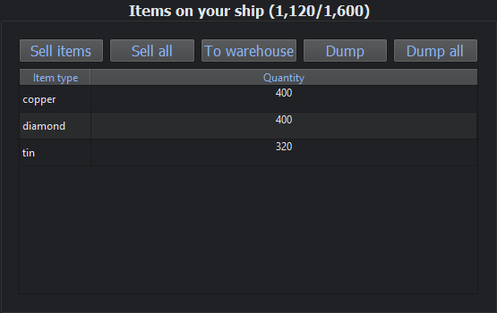

This section describes the functionality of the "Items on your ship" section of the main
game window. The "Items on your ship" section is used for browsing / managing items that
reside on the players ship, that have either been purchased from a planet or that have been
retrieved from the warehouse. The "Items on your ship" section is displayed in the middle
right area of the main game window.

* **"Sell items" button**: Allows the player to attempt to sell 1 or more of the selected
  item to the current planet. When clicked, this button will open a new window that allows
  the player to select the quantity they wish to sell of the selected item (See `"Sell items" window`_).
  If the current planet does not already hold any of the selected item, then the player
  will be asked if they want to provide a free (small quantity) sample of the item.
  If the player does not provide a free sample, then the item cannot be sold to the current
  planet. If the player does provide a free sample, then the planet may or may not decide to
  begin trading in the selected item. Only one free sample of a given item may be given to
  the same planet in the same day.

* **"Sell all" button**: Allows the player to attempt to sell all items on the ship to
  the current planet. Only items that the current planet already holds will be sold
  (free samples can only be provided via the "Sell items" button).

* **"To warehouse" button**: Allows the player to move 1 or more of the selected item
  from their ship to the warehouse. The warehouse is on the player's home planet, so this only works
  while the player is there. Unlike the player's ship, the warehouse has infinite
  capacity, but only two moves to/from the warehouse per day are allowed (i.e. two trips
  to the warehouse per day). Additional warehouse trips per day come with engine upgrades from the Store
  (See `"Store" window`_ for more details about the store window).
  Clicking this button opens a new window that allows the player to select the quantity of
  the item they want to move to the warehouse (see `"Move to warehouse" window`_).

* **"Dump" button**: Throws away the selected items to free up capacity on the
  player's ship. Opens a new window that allows the player to select the quantity they wish to
  dump of the selected item (See `"Dump player items" window`_).

* **"Dump all" button**: Throws away all items on the players ship.

* **Item display table**: Displays all items stored on the player's ship. Consists of
  two columns: The rightmost column, labelled "Quantity", shows the number of items stored
  on the player's ship. The leftmost column, labelled "Item type", shows the item name. The
  player can attempt to sell an item by double-clicking on the item name within the item
  display table.

**"Items in warehouse" section**
++++++++++++++++++++++++++++++++

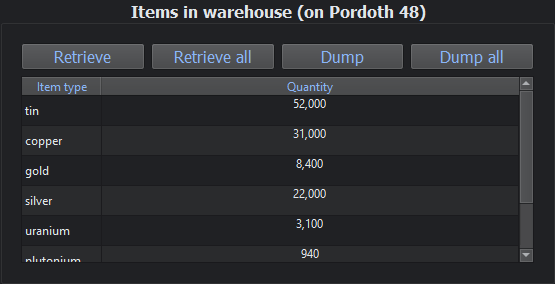

This section describes the functionality of the "Items in warehouse" section of the main
game window. The "Items in warehouse" section is used for browsing / managing items that
reside in the warehouse. The "Items in warehouse" section is displayed in the bottom
right area of the main game window. Its title shows the name of the player's home planet,
which is where the warehouse is. Items can only be moved to or from the warehouse while the player
is on their home planet, but items in the warehouse can be dumped from anywhere.

* **"Retrieve" button**: Allows the player to move 1 or more of the selected items
  from the warehouse to their ship, while the player is on their home planet. Only two moves to/from
  the warehouse per day are allowed (i.e. two trips to the warehouse per day), unless engine upgrades
  have been purchased from the Store. Clicking this button opens a new window that
  allows the player to select the quantity of the item they want to move to their ship (see
  `"Retrieve from warehouse" window`_).

* **"Retrieve all" button**: Moves all warehouse items (or however many will fit) to the
  player's ship, while the player is on their home planet.

* **"Dump" button**: Throws away the selected items from the warehouse. Opens a new
  window that allows the player to select the quantity they wish to dump of the selected items
  (see `"Dump warehouse items" window`_).

* **"Dump all" button**: Throws away all items in the warehouse.

* **Item display table**: Displays all items stored in the warehouse. Consists of
  two columns: The rightmost column, labelled "Quantity", shows the number of items stored
  in the warehouse. The leftmost column, labelled "Item type", shows the item name. The
  player can move an item to their ship by double-clicking on the item name within the item
  display table.

**"Store" window**
##################

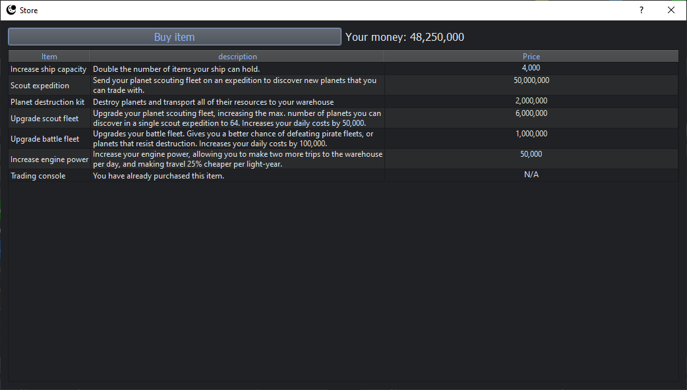

This section describes the functionality of the "Store" window. The store window can be reached
by clicking the "Go to store" button in the `Global buttons section`_ of the main window. The
store window allows the player to exchange money for various upgrades and services. Only 4 store
purchases can be made per day, but this number is increased when the player reaches certain scores
(see `Score bonuses`_ for more information).

* **Increase ship capacity**: Buying this item doubles the number of items that can be
  stored on the players ship. This item can be bought an unlimited number of times.

* **Scout expedition**: Buying this item allows the player to discover new planets (between 4-8
  new planets with a level 1 scout fleet), which will become available in the `"Planets" section`_. This item cannot be purchased unless
  the player has already purchased a scout fleet. More planets, further away, can be discovered per
  scout expedition by purchasing the "Upgrade scout fleet" store item. Items on remote planets are
  cheaper: the further a planet is from home, the lower its prices, down to half the usual price at
  the edge of the largest scout range.

* **Planet destruction kit**: Buying this item allows the player to destroy one or more planets and
  obtain all of their materials. Destroyed planets will disappear from the `"Planets" section`_ and all
  materials held by them will be transferred to the player's warehouse. Opens a new window that allows
  the player to pick which planets they want to destroy (each planet destroyed adds to the price), or
  optionally destroy all planets at once (except for the current planet). The player's home planet
  can never be destroyed, since the warehouse is there. There is a small chance that a single planet may
  resist destruction and attempt to fight back. The higher number of planets being destroyed, the
  higher the chance of one planet resisting will be. The player must decide whether to fight, or leave
  the planet alone. If the player fights and loses, the player will die and the game will be over.
  If the player fights and wins, then planet destruction will continue normally. The chance of
  the player winning this fight depends on the player's battle fleet level.

* **Buy/upgrade scout fleet**: Buying this item for the first time gives the player a
  scout fleet that allows the player to discover new planets to trade with. Subsequent
  purchases of this item upgrade the player's scout fleet, which increases the number of
  planets than can be discovered on a single scout expedition, and how far away they can be.
  Starting planets are up to 30 light-years from home, and a scout fleet at level N finds new planets
  between 30 and 30 × (N + 1) light-years from home (e.g. 30-60 ly at level 1, and 30-330 ly at level 10).
  The scout fleet can be upgraded 9 times, from level 1 through level 10.

  * *Scout fleet level 1*: between 4 and 8 new planets per scout expedition
  * *Scout fleet level 2*: between 8 and 16 new planets per scout expedition
  * *Scout fleet level 3*: between 16 and 32 new planets per scout expedition
  * *Scout fleet level 4*: between 32 and 64 new planets per scout expedition
  * *Scout fleet level 5*: between 64 and 128 new planets per scout expedition
  * *Scout fleet level 6*: between 128 and 256 new planets per scout expedition
  * *Scout fleet level 7*: between 256 and 512 new planets per scout expedition
  * *Scout fleet level 8*: between 512 and 1024 new planets per scout expedition
  * *Scout fleet level 9*: between 1024 and 2048 new planets per scout expedition
  * *Scout fleet level 10*: between 2048 and 4096 new planets per scout expedition

* **Buy/upgrade battle fleet**: Buying this item for the first time gives the player a
  battle fleet, which increases the chances of the player winning battles against planets
  that resist destruction, or when being robbed while travelling between planets. Subsequent
  purchases of this item upgrade the battle fleet, which increases the chances of
  the player winning battles against pirates or against planets that resist destruction.
  The battle fleet can be upgraded 9 times, from level 1 to level 10.

  * *Battle fleet level 0 (no battle fleet)*: 1% chance of winning battles
  * *Battle fleet level 1*: 10% chance of winning battles
  * *Battle fleet level 2*: 20% chance of winning battles
  * *Battle fleet level 3*: 30% chance of winning battles
  * *Battle fleet level 4*: 40% chance of winning battles
  * *Battle fleet level 5*: 50% chance of winning battles
  * *Battle fleet level 6*: 60% chance of winning battles
  * *Battle fleet level 7*: 70% chance of winning battles
  * *Battle fleet level 8*: 80% chance of winning battles
  * *Battle fleet level 9*: 90% chance of winning battles
  * *Battle fleet level 10*: 99% chance of winning battles

* **Increase engine power**: Buying this item will increase by 2 the number of warehouse trips that the
  player can make in a single day, and will make travel 25% cheaper per light-year. Engine power can be
  increased 10 times.

* **Trading console**: Buying this item will enable the "Trading console" button
  in the `"Planets" section`_, allowing you to see current item prices on any planet without
  travelling.

**"Buy items" window**
######################

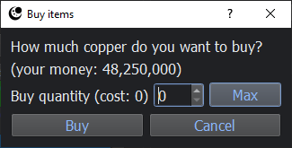

This section describes the functionality of the "Buy" window. The "Buy" window is displayed
when the player clicks the "Buy item" button in the `"Items on current planet" section`_.

* **"Buy" button**: Purchases the selected quantity of the item. This button will do nothing
  when the selected quantity is 0.

* **"Cancel" button**: Cancels the transaction.

* **"Max" button**: Automatically sets the quantity to the maximum number of items available,
  or the maximum number of items that the player can afford (whichever is smaller).

**"Sell items" window**
#######################

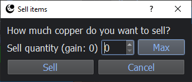

This section describes the functionality of the "Sell" window. The "Sell" window is displayed
when the player clicks the "Sell items" button in the `"Items on your ship" section`_.

* **"Sell" button**: Sells the selected quantity of the item. This button will do nothing
  when the selected quantity is 0.

* **"Cancel" button**: Cancels the transaction.

* **"Max" button**: Automatically sets the quantity to the maximum number of items available
  to sell.

**"Dump player items" window**
##############################

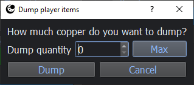

This section describes the functionality of the "Dump player items" window. The "Dump player items"
window is displayed when the player clicks the "Dump" button in the `"Items on your ship" section`_.

* **"Dump" button**: Dumps the selected quantity of the item. This button will do nothing
  when the selected quantity is 0.

* **"Cancel" button**: Cancels the item dump.

* **"Max" button**: Automatically sets the quantity to the maximum number of items available
  on the players ship.

**"Move to warehouse" window**
##############################

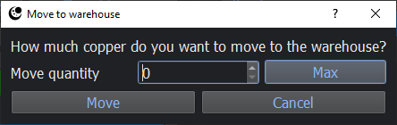

This section describes the functionality of the "Move to warehouse" window. The "Move to warehouse"
window is displayed when the player clicks the "To warehouse" button in the `"Items on your ship" section`_.

* **"Move" button**: Moves the selected quantity of the item to the warehouse. This button will do nothing
  when the selected quantity is 0.

* **"Cancel" button**: Cancels the item move.

* **"Max" button**: Automatically sets the quantity to the maximum number of items available
  on the players ship.

**"Dump warehouse items" window**
#################################

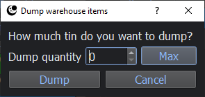

This section describes the functionality of the "Dump warehouse items" window. The "Dump warehouse items"
window is displayed when the player clicks the "Dump" button in the `"Items in warehouse" section`_.

* **"Dump" button**: Dumps the selected quantity of the item. This button will do nothing
  when the selected quantity is 0.

* **"Cancel" button**: Cancels the item dump.

* **"Max" button**: Automatically sets the quantity to the maximum number of items available
  in the warehouse.

**"Retrieve from warehouse" window**
####################################

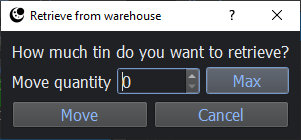

This section describes the functionality of the "Retrieve from warehouse" window. The "Retrieve from warehouse"
window is displayed when the player clicks the "Retrieve" button in the `"Items in warehouse" section`_.

* **"Move" button**: Moves the selected quantity of the item to the player's ship. This button will do nothing
  when the selected quantity is 0.

* **"Cancel" button**: Cancels the item move.

* **"Max" button**: Automatically sets the quantity to the maximum number of items available
  in the warehouse, or the maximum number of items that can fit on the player's ship (whichever is smaller).

**Item price history window**
#############################

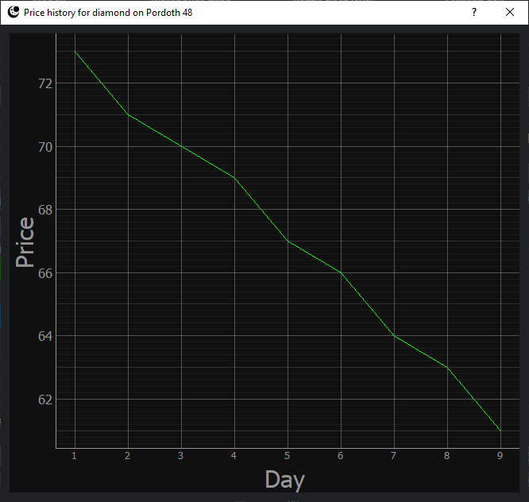

The item price history window shows the changing price of an item on a particular planet over time
(from day 1 until the current day). The item price history window is displayed when the player selects
an item in the `"Items on current planet" section`_ and presses enter.

**"High score sharing" window**
###############################

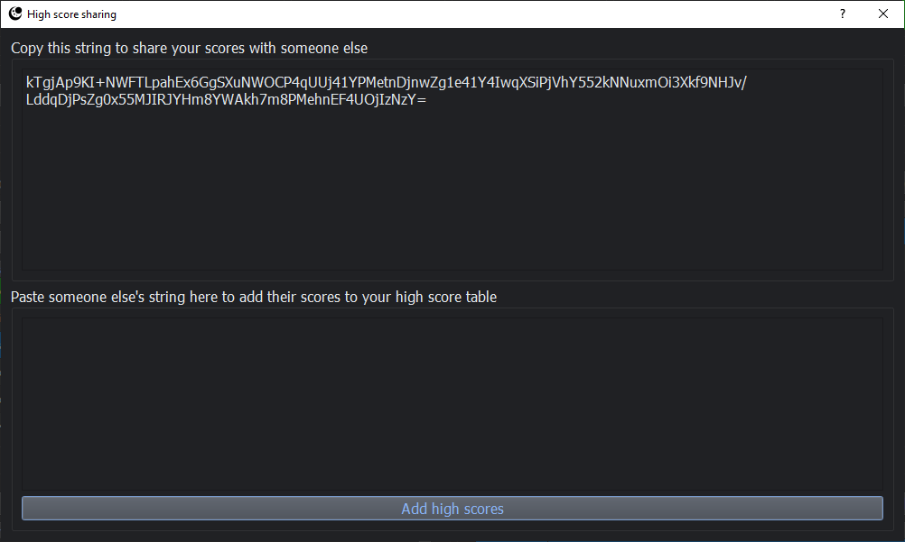

This section describes the functionality of the "High score sharing" window. The "High score sharing"
window is displayed when the "High score sharing" option is selected from the "File" menu in the
main game window (e.g. **File->High score sharing**). The "High score sharing" window can also be
opened via the keyboard shortcut Ctrl-R.

The "High score sharing" window allows players to share high scores, by copying/sharing an "encrypted"
string containing the players high scores. When a player copies another player's string into their
"High score sharing" window, then the scores contained within the string will be added to the player's
own high scores.

* **To share your high scores with someone else**: Copy the string displayed in the top section of
  the "High score sharing" window, and give it to the other player that you wish to share scores with.

* **To add someone elses high scores to your game**: Paste the string provided by another player into
  the bottom section of the "High score sharing" window, and click the "Add high scores" button at the
  bottom of the "High score sharing" window. The other players scores will be added to your high score table.

**"Star map" window**
#####################

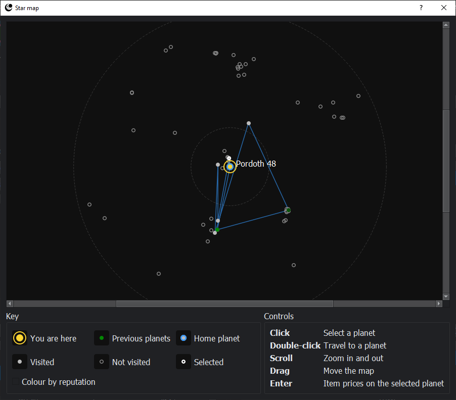

The "Star map" window shows every planet the player has discovered, at its position in the galaxy.
Planets tend to be grouped in clusters, and planets with the same name and number but different letters
(e.g. "Kandar 12 c" and "Kandar 12 d") are in the same star system, very close to each other.
It is displayed when the "Star map" option is selected from the "Tools" menu in the main game window
(e.g. **Tools->Star map**), or when the "Star map..." button in the `"Planets" section`_ is clicked.
It can also be opened via the keyboard shortcut Ctrl-G.

* The current planet is shown as a large yellow dot with a ring around it, and its name is always shown.
  The two previous planets are shown in two shades of green.
* The home planet has a blue ring.
* Visited planets are filled grey dots, and planets not visited yet are hollow grey rings.
* The selected planet has a white ring.
* A blue line joins every planet the player has travelled to, in order, starting from the home planet,
  showing the player's whole journey.
* Faint dashed circles show the area of the starting planets, and the range of the player's scout fleet.
* While the planets search box has text in it, planets that don't match are dimmed.

Moving the mouse over (or near) a planet shows its name straight away, and holding the mouse still
shows its distance and the cost of travelling there. Clicking a planet
selects it in the `"Planets" section`_, and double-clicking it travels there. Pressing the Enter key opens the
trading console for the selected planet, as in the `"Planets" section`_ (only if the "Trading console" item has been
purchased from the `"Store" window`_). The mouse wheel zooms in and
out, and dragging moves the map.

**"Prices" window**
###################

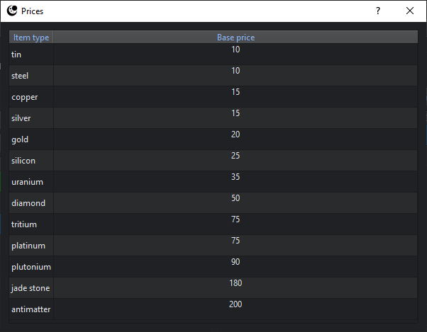

The section describes the functionality of the "Prices" window. The "Prices" window is displayed
when the "Material prices" option is selected from the "Tools" menu in the main game window
(e.g. **Tools->Material prices**). The "Prices" window can also be opened via the keyboard shortcut Ctrl-A.

The "Prices" window shows the usual price for all materials, and can be used as a trading reference.
The "Prices" window does *not* show the exact item prices for any particular planet. Planets will set their
own item prices, and the prices in the "Prices" window are merely suggestions for them.

**"Travel log" window**
#######################

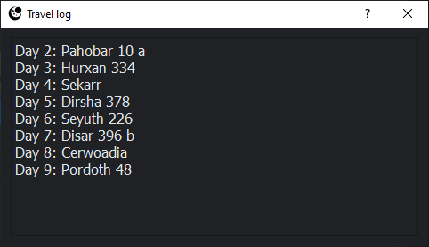

This section describes the functionality of the "Travel log" window. The "Travel log" window
is displayed when the "Show travel log" option is selected from the "Tools" menu (e.g.
**Tools->Show travel log**). The "Travel log" window can also be opened via the keyboard shortcut
Ctrl-S.

The "Travel log" shows all planets that the player has travelled to, in chronological order, along
with the day on which they were travelled to.

**"Transaction log" window**
############################

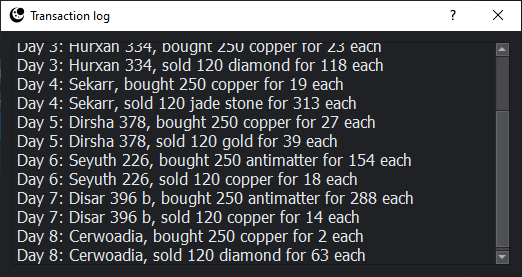

This section describes the functionality of the "Transaction log" window. The "Transaction log" window
is displayed when the "Show transaction log" option is selected from the "Tools" menu (e.g.
**Tools->Show transaction log**). The "Transaction log" window can also be opened via the keyboard shortcut
Ctrl-T.

The "Transaction log" shows all material sales/purchases made by the player, in chronological order, along
with the day on which the transaction occurred and the planet involved in the transaction.

**Rumours**
###########

A window like this may appear from time to time, informing you of a rumour that a particular
item will be unusually expensive or unusually cheap on a particular planet on the following day:

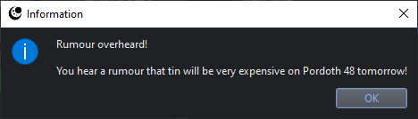

These rumours are sometimes true, and sometimes not. If an item is rumoured to be unusually
cheap, then you may want to travel to the planet mentioned and stock up on the cheap item
once you arrive. If an item is rumoured to be unusually expensive, you may want to stock
up on that item on your current planet, then travel to the planet mentioned and sell
off the item once you arrive. Of course, if the rumour turns out to be false, then you
will have wasted time/money.

If you choose to follow the rumour, then you will see a window like this after travelling
to the mentioned planet, letting you know whether the rumour was true or not:

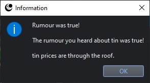

**Miscellaneous details**
#########################

This section describes miscellaneous functionality that is not necessarily related
to any particular game window.

Score bonuses
+++++++++++++

When the player reaches 1,000,000,000 money, the total number of days is increased from 30 to 35,
and the number of store purchases allowed per day is increased from 4 to 5.

When the player reaches 100,000,000,000 money, the total number of days is increased from 35 to 40,
and the number of store purchases allowed per day is increased from 5 to 6.
