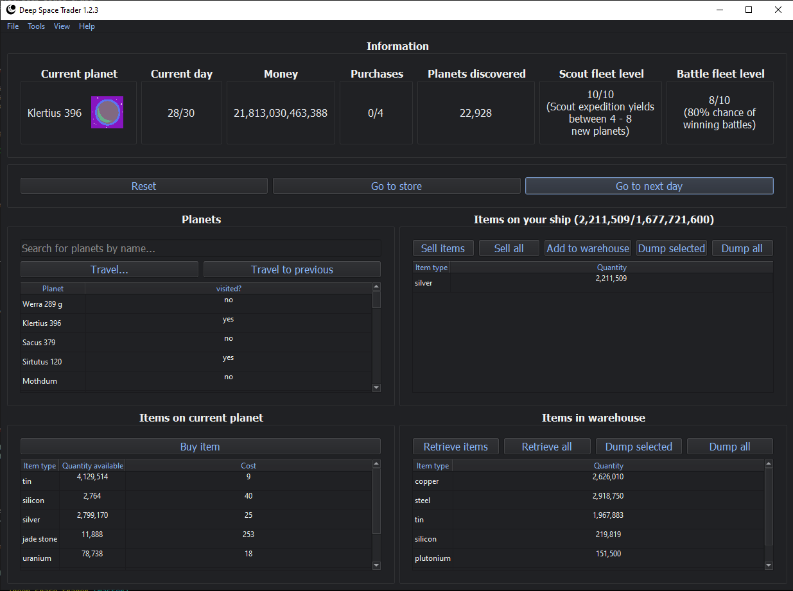

Deep Space Trader
-----------------

Deep Space Trader is a turn-based strategy game inspired by, and similar in gameplay to,
the old DOS game "Drugwars".

Install
=======

Pre-built windows binary
########################

Download the `Windows x64 installer <https://github.com/eriknyquist/deep_space_trader/raw/master/windows_build/deep-space-trader-1.2.3.exe>`_

Python package
##############

Install as a python package:

::

    pip install deep_space_trader

Description
###########

The player starts off on a planet within a system of 8 randomly-generated planets.
Each planet has various raw materials available for trading (13 types of raw material in total),
all with prices that differ from planet to planet, and fluctuate over time. The goal of the game
is to make as much money as possible by buying and selling raw materials between planets.

The player has an item inventory for raw materials, with a fixed (but upgradeable) capacity.
Only items in the inventory can be bought or sold. The player also has a warehouse with unlimited
capacity. Items can be transferred between the item inventory and the warehouse, but only
a certain number of transfers between item inventory and warehouse can be made per day.

Travelling between planets always incurs a risk of encountering pirates, who may
kill the player or rob them of their money / raw materials. The greater the value that the
player is travelling with (combined value of player's money and items in the player's inventory,
but not the warehouse), the greater the chance of encountering pirates.

The player can use any earned money to buy "upgrades" from a store. Only a certain number of
store purchases can be made per day. Some of the upgrades
allow the player to:

* Destroy planets altogether and acquire all their raw materials
  (Destroying a planet incurs a risk that the planet may fight to resist, which may kill the player)

* Buy and upgrade a battle fleet, which increases chances of winning fights against pirates,
  and against planets that resist destruction

* Buy and upgrade a scout fleet, which allows the player to discover thousands of
  new planets

* Upgrade the player's inventory capacity, which increases the number of items that can
  be bought or sold at once.

* Increment the number of warehouse trips allowed per day
